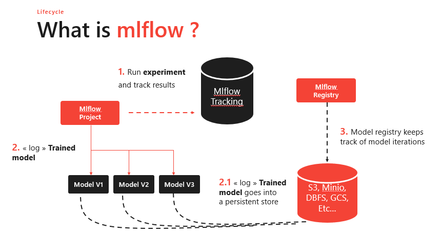

# MLOPS Computer vision

[](https://github.com/SeldonIO/alibi-detect/actions?query=workflow%3A%22CI%22)
[](https://docs.seldon.io/projects/alibi-detect/en/latest/?badge=latest)

[](https://badge.fury.io/py/alibi-detect)


Ce projet est un exemple de mlops appliqué à des problematiques de computer vision.


## Table of Contents


- [Introduction](#Introduction)
- [Pré-requis](#Pré-requis)
- [Installation](#Installation)


## Introduction

Parmi les nombreux domaines de l'intelligence artificielle, aux côtés du traitement automatique du langage naturel, la vision par ordinateur (Computer Vision) a l'un des plus grands potentiels pour des applications pratiques. Compte tenu du volume important des images et vidéos générées sur le Web ou au sein des entreprises privées et des développements récents dans le domaine de l'apprentissage profond, les applications de Computer Vision (classification des images, détection d'objets, reconnaissance faciale, détection de scènes etc.) sont de plus en plus utilisées. À partir de 2012, nous avons assisté à un développement accéléré des algorithmes d'apprentissage profond pour la vision par ordinateur, avec des performances accrues sur diverses tâches année après année. Au cours de la même période, les frameworks d'apprentissage profond ont atteint une maturité qui leur permet d'être utilisés en dehors de la recherche, sur de nombreuses applications réelles. Toutefois, dans la pratique, il reste de nombreux défis à relever afin de mettre en œuvre efficacement les modèles de computer vision dans un scénario de production. C'est dans optique qu'un courant nommé Mlops à ermergé ces dernière années.  

Les Machine Learning Operations sont un ensemble de pratiques pour permettre à toutes entreprises d’exécuter leur stratégie IA et Machine Learning avec succès.
MLOps est inspiré de DevOps, qui est un ensemble de pratiques pour écrire, déployer et exécuter de manière efficace les applications d’entreprise. Comme DevOps, ML Ops va combiner développement logiciel et les opérations IT, cependant les workflows sont centrés sur les processus spécifiques du machine learning.
Grâce au MLOps les cycles de vie de développement et d’opération de systèmes complexes de machine learning sont réduits et automatisés. Il devient possible d’entraîner, d’évaluer et de livrer en continu des modèles de machine learning de grande qualité. MLOps est complémentaire d’une approche Agile du Machine Learning.


## Pré-requis

Ce qu'il est requis pour commencer:

- [Docker](https://www.docker.com/)
- Python==3.8

## Installation

### Training

Pour entrainer ou ré-entrainer notre model, il suffit d'installer les dépendances qui se trouve dans le readme. Il est préferable d'utiliser un environnement.

Pour la création d'un ``env`` :

```bash
python -m venv env
```
Une fois notre **env** créé, il faut se mettre dedans:

- Linux
  - ```bash
    source  env/bin/activate
    ```
- Windows
  - ```bash
    .\env\Scripts\Activate.ps1
    ```

Pour installer les dépendances, on utilise [PyPI](https://pypi.org/project)

```bash
pip install -r requirements.txt
```

> Le code de l'entrainement se trouve dans le dossier model.

### Serving

Pour lancer les différentes images docker du server/prometheus et grafana, il suffit d'utiliser le docker-compose :  

```bash
docker-compose up --build
```

> Il est possible de rajouter ``-d`` pour détacher du terminal nos images.

Pour vérifier que l'image est bien lancée:  ``docker ps``.  

Vous devriez voir 3 containers lancé.

Cependant il est possible de les construire et les lancer indépendament sans docker-compose.


``docker run -p 5001:5001  --mount type=bind,source=$(pwd),target=/app <NAME>``


> Il est possible de changer le port d'accès sur la machine `-p <PORT>:5001`, on peut aussi le modifier dans le `docker-compose.yml`.

Une fois lancé, nous avons 3 images docker qui tourne en parallele. 

- Le server en [Fastapi](https://fastapi.tiangolo.com/) qui tourne sur le port **5001**
- [Prometheus](https://prometheus.io/docs/) qui tourne sur le port **9090**
- [Grafana](https://grafana.com/) qui tourne sur le port **3000**

## Utilisation

### Entrainement

Nous chechons a classifiers des images par classe. Notre modele est un [convolutional neural network](https://fr.wikipedia.org/wiki/R%C3%A9seau_neuronal_convolutif) (CNN) dit prend en entré des images de taille (35,35) et ressort un vecteur de taille N qui reprensent les N classes.

Notre premier objectif est de pouvoir logger les differentes metrics, parametres, data et modeles.

Pour cela nous allons utiliser [Mlflow](https://github.com/mlflow/mlflow).

<p align="center">
  
</p>

Cette outils va tracker chaque entrainement afin de stocker les différentes informations qui nous intéresse dans une base de donnée.

Grace a l'interface utilisateur de [Mlflow](https://github.com/mlflow/mlflow), nous pouvons avoir acces aux differents informations de chacun des runs.


<p align="center">
  
</p>

et même mettre en production un model sauvegarder grave au model registry


## Link

- [Mlflow](https://github.com/mlflow/mlflow)
- [Tensorflow](https://www.tensorflow.org/?hl=fr)
- [DVC](https://dvc.org/)
- [Fastapi](https://fastapi.tiangolo.com/)
- [Prometheus](https://prometheus.io/docs/instrumenting/clientlibs/)
- [Grafana](https://grafana.com/)
- [Docker](https://www.docker.com/)
